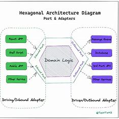

# The service provides functionality for booking a parking.

## Architecture
We use Hexagonal architecture to implement the service.
Hexagonal architecture makes the software easy to maintain, manage, test, and scale.
The other name of Hexagonal architecture is Ports And Adapters architecture. 
This architecture divides an application into two parts namely, the inside part and the outside part. 
The core logic of an application is considered as the inside part. 
The database, UI, and messaging queues could be the outside part. 
In doing so, the core application logic has been isolated completely from the outside world. 
Now the communication between these two parts can happen through Port and Adapters.

## Security

## Run application